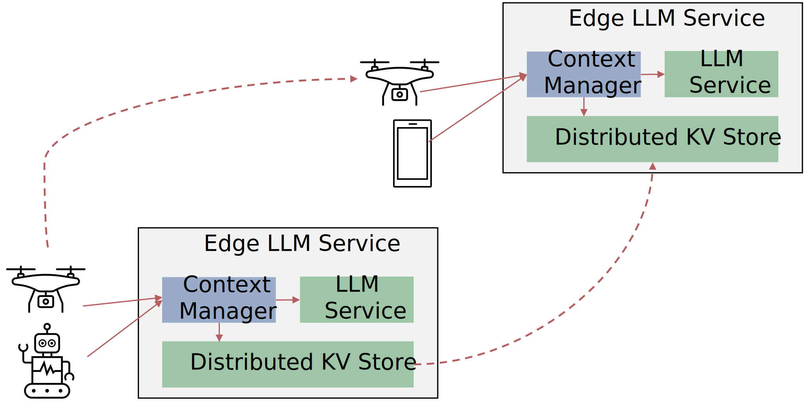

# DisCEdge: Distributed Context Management for Large Language Models at the Edge

DisCEdge is a distributed context management system designed to enable efficient, low-latency Large Language Model (LLM) inference in edge computing environments.

Deploying LLMs at the edge offers significant privacy and latency benefits, but managing state across geo-distributed nodes is a major challenge. DisCEdge addresses this by replicating user context (such as session history and preferences) in **tokenized form**. By maintaining context as token sequences rather than raw text, the system avoids redundant tokenization overhead, minimizes network bandwidth usage, and ensures data consistency as mobile clients roam between edge nodes.



*DisCEdge Architecture Overview. The system consists of modular edge nodes containing a Context Manager, LLM Service, and Distributed KV Store.*

## Configuration

Configuration is managed via constants in `cmd/main.go`.

- `runServerMode`: Set to `true` for server mode or `false` for scenario mode.
- `serverListenAddr`: The address and port for the server to listen on (e.g., `:8081`).
- `scenarioFilePath`: Path to the YAML file for scenario mode (e.g., `testdata/example_robo_longer.yml`).
- `llamaURL`: URL of the LLaMa.cpp server.
- `fredAddr`: Address of the FReD service.
- `fredKeygroup`: Keygroup to use in FReD for context storage.

## Usage

The application can be run in two modes:

### Server Mode

When `runServerMode` is `true`, the application starts an HTTP server that listens for completion requests. It manages session and context persistence automatically.

The API payload is compatible with the LLaMa.cpp `/completion` endpoint but includes additional parameters for context management:

- `mode`: `raw`, `tokenized`, or `client-side`.
- `session_id` (optional): To continue an existing session. If omitted, a new session is created.
- `user_id` (optional): To associate the session with a user.
- `turn`: A client-side counter for the conversation turn, used for synchronization.

**Example Request:**
```json
{
	"model": "Qwen1.5-0.5B-Chat-Q4_K_M:latest",
	"prompt": "What language does people speak there",
	"temperature": 0,
	"seed": 123,
	"stream": false,
	"mode": "raw",
	"user_id": "u1"
}
```
**Example Response:**
The response from LLaMa.cpp is augmented with session information.
```json
{
    "content": "...",
    "session_id": "...",
    "user_id": "...",
    "mode": "raw"
}
```

### Scenario Mode

When `runServerMode` is `false`, Context Manager runs in a non-interactive test mode based on a scenario file. This mode is useful for automated testing and benchmarking.

- It reads a sequence of user messages from a YAML file specified by `scenarioFilePath`.
- At startup, it prompts the user to choose the context method (`raw` or `tokenized`) for the entire scenario run.
- It processes the messages sequentially, simulating a conversation and logging performance metrics to a CSV file in `testdata/log/`.


## Experiment setup (paper version)
1. run `fred/etd.sh` on a node
2. clear etcd data `etcdctl del "" --from-key`
3. run [LLaMa.cpp-fastencode](https://github.com/ChaosRez/llama.cpp-fastencode) on nodes. This fork is modified to accept a pre-tokenized context, which is required for the `tokenized` mode.
   - `./server -m ./Qwen1.5-0.5B-Chat-Q4_K_M.gguf -c 2048 -n 128 -b 512 -ngl 33` (had to explicitly specify for Jetson TX2 to run on GPU)
   - Parameters:
     - `-c N`: size of the prompt context (default: 512)
     - `-n N`: maximum tokens to predict (default: -1)
     - `-ngl N`: number of layers to store in VRAM
     - `-b N`: batch size for prompt processing (default: 512)
4. run `fred/edge-node-*.sh` on nodes
5. run LLM Context Manager on nodes (check `fredAddr` to be correct)
6. run `fred_traffic_monitor.sh` on nodes to capture FReD traffic
   - Example: `./fred_traffic_monitor.sh raw-TX2 250` or `fred_traffic_monitor.sh tokenized-TX2 250`
   - See `fred_traffic_monitor.md` for detailed usage, prerequisites, and experiment workflow
7. run client

### Notes
- All FReD scripts are in `fred/`.
- The `config.sh` script sets up the environment variables such as node IP addresses. No need to run this script manually, it is sourced automatically by other scripts.
- You need to generate certificates `gen-cert.sh`

### etcd client useful commands
```bash
# list all keys
etcdctl --cacert=cert/ca.crt \                                                                             
        --cert=cert/frededge1.crt \
        --key=cert/frededge1.key \
get "" --prefix --keys-only
# delete all keys
etcdctl --cacert=cert/ca.crt \                                                                             
        --cert=cert/frededge1.crt \
        --key=cert/frededge1.key \
del "" --from-key

```